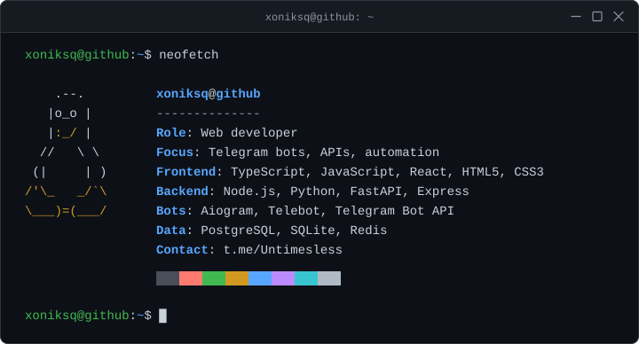
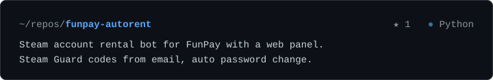
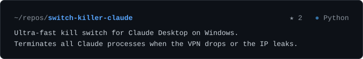

  

<h3 align="center"><code>~/repos</code></h3>

<!-- repos:start -->

  

  

<!-- repos:end -->

  <a href="https://t.me/Untimesless">telegram</a> ·
  <a href="https://github.com/xoniksq?tab=repositories">all repositories</a>

